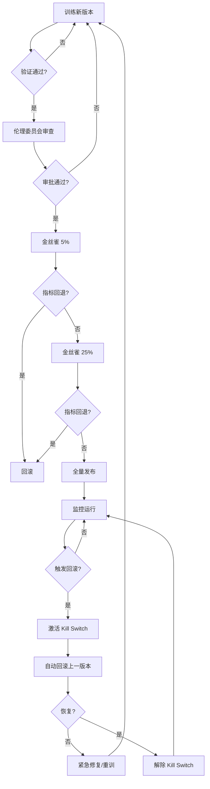

# HRA-A03 模型治理手册

| 项 | 值 |
|---|---|
| 文档编号 | HRA-A03-V1.0 |
| 文档版本 | V1.0 |
| 编制日期 | 2026-07-27 |
| 编制人 | 邝振华 |
| 文档状态 | 正式 |
| 适用范围 | HRA V1.0 模型全生命周期治理 |
| 关联文档 | D03 系统设计 / A01 运维手册 / A02 应急预案 / D11 验收标准 |

> 本手册规范 HRA 模型从训练到退役的全生命周期治理，覆盖 PIPL/欧盟 AI Act 高风险类别要求。模型治理能力是 M-MODEL-05~10 验收项的依据。

---

## 1. 模型生命周期

### 1.1 生命周期阶段

```
训练 → 验证 → 金丝雀发布（5%/25%/100%）→ 全量 → 监控 → 回滚/退役
 │      │            │                       │       │          │
 │      │            │                       │       │          └─→ 归档
 │      │            │                       │       └─→ 漂移/公平性/性能监控
 │      │            │                       └─→ model_versions 表登记
 │      │            └─→ 灰度切流 + 指标对比
 │      └─→ AUC/Recall/公平性/SHAP 覆盖率
 └─→ 数据准备 + 特征工程 + 训练 + 工件保存
```

### 1.2 阶段准入准出条件

| 阶段 | 准入条件 | 准出条件 | 责任人 |
|---|---|---|---|
| 训练 | 训练数据 hash 已登记；禁用特征扫描通过 | 工件已保存至 `app/ml/models/` | ML 工程师 |
| 验证 | 训练完成 | AUC ≥ 0.85；Recall ≥ 0.80；公平性 4 维度 < 5%；SHAP 100% | ML 工程师 |
| 金丝雀 5% | 验证通过 | 5% 流量指标无回退（AUC 降 < 2%）| ML + 运维 |
| 金丝雀 25% | 5% 通过 | 25% 流量指标无回退 | ML + 运维 |
| 全量发布 | 25% 通过 | 100% 流量；伦理委员会备案 | 应急指挥 |
| 监控 | 全量发布 | 漂移 < 0.2；公平性 < 5%；AUC 月降 < 5% | 运维（自动）|
| 回滚 | 触发条件满足（见 §5）| 上一版本恢复 | 应急指挥 |
| 退役 | 新版本全量稳定 30 天 | 工件归档 OSS | ML 工程师 |

---

## 2. 模型版本管理

### 2.1 版本号规则

- **格式**：`fusion-engine-v{n}`（如 `fusion-engine-v1`）
- **当前版本**：`fusion-engine-v1`（LightGBM 0.7 + IsolationForest 0.3 融合）
- **新版本触发**：重训 / 特征工程变更 / 融合权重调整 / 算法替换

### 2.2 工件存储

| 工件 | 路径 | 说明 |
|---|---|---|
| 结构化模型 | `backend/app/ml/models/structured_lgbm.pkl` | LightGBM + feature_columns |
| 行为模型 | `backend/app/ml/models/behavior_if.pkl` | IsolationForest + norm_lo/hi |
| 融合指标 | `backend/app/ml/models/fusion_metrics.json` | AUC/Recall/分类报告 |
| 测试预测 | `backend/app/ml/models/test_predictions.csv` | 含审计字段（公平性测试用）|
| 公平性报告 | `backend/app/ml/models/fairness_report.json` | 4 维度偏差 |
| 漂移报告 | `backend/app/ml/models/drift_report.json` | 每日生成 |
| SHAP 解释器 | `backend/app/ml/models/shap_explainer.pkl` | TreeExplainer |

### 2.3 model_versions 表

```sql
CREATE TABLE model_versions (
    id UUID PRIMARY KEY,
    version VARCHAR(50) NOT NULL UNIQUE,        -- fusion-engine-v1
    algorithm VARCHAR(50) NOT NULL,             -- lightgbm+isoforest
    fusion_weights JSONB NOT NULL,              -- {"structured":0.7,"behavior":0.3}
    auc_test FLOAT NOT NULL,                    -- 0.9862
    recall_at_top20 FLOAT NOT NULL,             -- 0.8832
    max_parity_diff FLOAT NOT NULL,             -- 0.0320
    training_data_hash VARCHAR(64) NOT NULL,    -- SHA256 of training data
    artifact_path VARCHAR(500) NOT NULL,        -- app/ml/models/
    status VARCHAR(20) NOT NULL,                -- training/canary/active/retired
    created_at TIMESTAMPTZ NOT NULL,
    activated_at TIMESTAMPTZ,
    retired_at TIMESTAMPTZ
);
```

**当前登记**：

| version | algorithm | auc_test | recall_at_top20 | max_parity_diff | status | activated_at |
|---|---|---|---|---|---|---|
| fusion-engine-v1 | lightgbm+isoforest | 0.9862 | 0.8832 | 0.0320 | active | 2026-08-17 |

---

## 3. 漂移检测

### 3.1 检测机制

- **算法**：PSI（Population Stability Index）+ KL 散度
- **实现**：`app/ml/drift_detector.py`
- **计算流程**：
  1. 对 baseline 等频分桶（n_bins=10）得边界
  2. current 用相同边界计算各桶比例
  3. PSI = Σ (curr - base) × ln(curr / base)
  4. 比例加 1e-6 平滑避免除零

### 3.2 调度与阈值

| 项 | 值 |
|---|---|
| 调度 | Celery beat 每日 02:00（`app/celery_app.py::drift-detection-daily`）|
| 任务 | `app.tasks.model_governance::detect_drift` |
| baseline | 训练集分布（`X_train`）|
| current | 近 7 天预测输入分布 |
| 检测特征 | 全部结构化特征列 |

**阈值规则**（`app/ml/drift_detector.py`）：

| PSI 范围 | 状态 | 触发动作 |
|---|---|---|
| PSI < 0.1 | stable | 记录日报 |
| 0.1 ≤ PSI < 0.2 | warning | 邮件告警；连续 3 天 warning → 重训 |
| PSI ≥ 0.2 | critical | Kill Switch 激活；回滚模型（见 §5）|

### 3.3 漂移报告字段

```json
{
  "max_psi": 0.08,
  "critical_features": [],
  "warning_features": ["salary_percentile"],
  "summary": "检测 15 个特征，max_psi=0.0800，critical=0，warning=1",
  "passed": true,
  "features": [
    {"feature": "salary_percentile", "psi": 0.12, "kl": 0.08, "status": "warning"},
    {"feature": "tenure_months", "psi": 0.05, "kl": 0.03, "status": "stable"}
  ]
}
```

---

## 4. 公平性监测

### 4.1 4 维度定义

| 维度 | 分组 | 字段来源 | 说明 |
|---|---|---|---|
| 性别 | M / F | `employees.gender` | 模型禁用，仅审计 |
| 年龄 | <35 / >=35 | `employees.birth_date` 派生 `age_derived` | 模型禁用，仅审计 |
| 民族 | 汉族 / 少数民族 | `employees.ethnicity_encrypted` 解密 | 员工单独同意，模型禁用 |
| 残障 | 无障碍 / 有障碍 | `employees.disability_encrypted` 解密 | 员工单独同意，模型禁用 |

### 4.2 指标与阈值

- **指标**：demographic parity difference = 各组"高风险预测"率之差最大绝对值
- **高风险定义**：`risk_score >= 60`
- **实现**：`app/ml/fairness_test.py`

**阈值规则**：

| 偏差范围 | 级别 | 触发动作 |
|---|---|---|
| < 5% | 正常 | 记录日报 |
| 5% - 8% | 告警 | 邮件通知 + 24h 排查 |
| > 8% | 严重 | Kill Switch 自动激活 + 公平性重训 + 伦理委员会审查 |

### 4.3 调度

- **频率**：每日 03:00（Celery beat `fairness-report-daily`）
- **任务**：`app.tasks.model_governance::fairness_daily_report`
- **报告路径**：`app/ml/models/fairness_report.json`

### 4.4 阈值调整缓解

当默认阈值 60 下偏差超标，`run_fairness_test()` 自动在 50-70 间搜索使最大偏差最小的阈值（偏向 60）：

```python
# app/ml/fairness_test.py
THRESHOLD_GRID = list(range(50, 71))
# 选择 max_parity 最小的阈值；并列时选最接近 60 的
```

缓解后报告 `mitigation_applied=true`，记录 `final_threshold`。

---

## 5. 自动回滚

### 5.1 触发条件

满足以下任一条件自动触发回滚（`app/tasks/model_governance::auto_rollback`）：

| 条件 | 阈值 | 说明 |
|---|---|---|
| 漂移连续 critical | 连续 3 天 `max_psi >= 0.2` | 数据分布显著变化 |
| AUC 下降 | 月度 AUC 降幅 > 5% | 模型性能退化 |
| 公平性严重超标 | `max_parity_difference > 0.08` | 伦理风险 |
| Kill Switch 激活 | 手动/自动激活 | 紧急熔断 |

### 5.2 回滚流程

```python
# 伪代码：app/tasks/model_governance.py
def auto_rollback(trigger: str):
    current = get_active_version()           # fusion-engine-v2
    previous = get_previous_active_version() # fusion-engine-v1
    if previous is None:
        # 无可回滚版本，仅 Kill Switch
        kill_switch.activate(reason=f"无可用回滚版本: {trigger}")
        return
    # 切换工件
    swap_artifacts(previous)
    # 更新 model_versions 状态
    update_status(current, "rolled_back")
    update_status(previous, "active")
    # 通知
    notify_ops(f"模型已回滚: {current} → {previous}, trigger={trigger}")
    write_audit_log(action="model.rollback", resource_type="model")
```

### 5.3 回滚验证

```bash
# 1. 确认版本切换
curl -s http://localhost:8000/api/v1/admin/model-version | jq .version
# 期望：fusion-engine-v1

# 2. 确认 AUC 恢复
cat backend/app/ml/models/fusion_metrics.json | jq .auc_test
# 期望：>= 0.85

# 3. 确认公平性
cat backend/app/ml/models/fairness_report.json | jq .overall_passed
# 期望：true

# 4. 解除 Kill Switch（伦理委员会签字后，若涉及公平性）
curl -X POST http://localhost:8000/api/v1/admin/kill-switch/deactivate ...
```

---

## 6. Kill Switch

### 6.1 设计原则

- **全局开关**：Redis key `kill_switch:active`（不限租户）
- **fail-open**：Redis 不可用时 `is_active()` 返回 False（不阻塞服务），仅 log warning
- **激活后行为**：`RiskService.predict` 返回安全降级结果（`risk_score=50, model_version=kill-switch-active`）
- **双版本**：同步版（Celery）+ 异步版（FastAPI 端点）

### 6.2 激活条件

| 条件 | 触发方 | 说明 |
|---|---|---|
| 模型漂移 critical 连续 3 天 | 自动（`auto_rollback`）| 见 §5.1 |
| 公平性偏差 > 8% | 自动（`fairness_daily_report`）| 见 §4.2 |
| AUC 月降 > 5% | 自动（月度任务）| 见 §5.1 |
| 手动激活 | 运维/应急指挥 | P0/P1 事件 |
| PII 泄露 | 自动/手动 | 见 A02 场景 6 |

### 6.3 操作流程

**激活**：

```bash
# API 方式（推荐，自动写审计日志）
curl -X POST http://localhost:8000/api/v1/admin/kill-switch/activate \
  -H "Authorization: Bearer <admin-token>" \
  -H "Content-Type: application/json" \
  -d '{"reason":"公平性偏差超标 8.5%"}'

# Redis 手动方式（API 不可用时）
docker compose exec redis redis-cli SET kill_switch:active \
  '{"active":"1","reason":"manual","activated_at":"2026-09-15T10:00:00Z","activated_by":"ops"}'
```

**查询状态**：

```bash
curl -s http://localhost:8000/api/v1/admin/kill-switch \
  -H "Authorization: Bearer <token>" | jq .
# {"active": true, "reason": "...", "activated_at": "...", "activated_by": "..."}
```

**解除**：

```bash
curl -X POST http://localhost:8000/api/v1/admin/kill-switch/deactivate \
  -H "Authorization: Bearer <admin-token>"
```

### 6.4 影响范围

| 组件 | 激活后行为 |
|---|---|
| RiskService.predict | 返回 `risk_score=50, model_version=kill-switch-active` |
| 前端 Dashboard | 显示"模型服务降级"横幅 |
| 预警生成 | 暂停（基于降级分数无意义）|
| LLM 建议 | 仍可用（基于降级分数生成）|
| 审计日志 | Kill Switch 操作单独记录 |

### 6.5 解除流程

1. 确认触发条件已消除（漂移恢复 / 公平性重训通过 / 漏洞修复）
2. 伦理委员会签字（若涉及公平性）
3. 应急指挥批准
4. 执行 `deactivate` API（写审计日志）
5. 通知 HR 恢复使用

---

## 7. 4 层回退

### 7.1 回退链

```
通义千问 Max（主）→ DeepSeek-V3（备）→ 规则模板 → 启发式
```

### 7.2 各层说明

| 层级 | 触发条件 | 实现 | 延迟 | 质量 |
|---|---|---|---|---|
| L1 通义千问 Max | 默认 | `app/services/llm_service.py::_call_dashscope_sse` | 首字 < 2s | 高 |
| L2 DeepSeek-V3 | L1 超时/限流/失败 | 同上（切换 model 参数）| 首字 < 2s | 高 |
| L3 规则模板 | L2 失败 | `_fallback_template` 按 SHAP 因子生成 | 即时（< 100ms）| 中 |
| L4 启发式 | （预留）兜底 | 静态建议（"建议安排 1v1 辅导"）| 即时 | 低 |

### 7.3 切换逻辑

```python
# app/services/llm_service.py::LLMService.stream_advice
try:
    async for chunk in cls._call_dashscope_sse(prompt, settings.LLM_PRIMARY):  # L1
        yield chunk
    return
except Exception:
    logger.warning("通义千问 Max 调用失败，尝试备用 LLM")

if settings.LLM_FALLBACK:
    try:
        async for chunk in cls._call_dashscope_sse(prompt, settings.LLM_FALLBACK):  # L2
            yield chunk
        return
    except Exception:
        logger.warning("备用 LLM 调用失败，降级规则模板")

# L3 规则模板
template = _fallback_template(sanitized_employee, shap_factors, risk_score)
for segment in template.split("\n\n"):
    yield {"chunk": segment + "\n\n"}
yield {"metadata": {"tokens_used": 0, "model": "rule-template", "latency_ms": 50}}
```

### 7.4 监控

- **指标**：每层调用次数 / 失败率 / 延迟
- **Grafana 面板**：LLM Fallback Distribution
- **告警**：L3 触发率 > 10% → 告警（LLM 服务整体不稳）

---

## 8. 禁用特征清单

### 8.1 禁用特征（绝不作为模型输入）

| 特征 | 字段 | 禁用原因 | 审计方式 |
|---|---|---|---|
| 性别 | `gender` | 反歧视 | 训练数据列扫描 |
| 民族 | `ethnicity_encrypted` | 反歧视 | 训练数据列扫描 |
| 残障 | `disability_encrypted` | 反歧视 | 训练数据列扫描 |
| 出生日期 | `birth_date` | 年龄歧视（仅派生 age 用于审计）| 训练数据列扫描 |
| 政治面貌 | （不采集）| PIPL 敏感信息 | 数据采集审查 |
| 宗教信仰 | （不采集）| PIPL 敏感信息 | 数据采集审查 |
| 性取向 | （不采集）| PIPL 敏感信息 | 数据采集审查 |

### 8.2 双重保障

1. **数据层**：`employees` 表中 `gender`/`ethnicity`/`disability`/`birth_date` 字段标注"仅用于公平性审计，模型禁用"（见 `app/models/employee.py`）
2. **模型层**：`feature_columns` 不含上述字段；`train_pipeline` 训练前扫描确认

### 8.3 审计命令

```bash
cd backend
# 扫描训练特征列
python -c "
import joblib
art = joblib.load('app/ml/models/structured_lgbm.pkl')
banned = ['gender','ethnicity','disability','birth_date','political','religion','sexual_orientation']
leak = [f for f in art['feature_columns'] if any(b in f for b in banned)]
print(f'禁用特征入模: {leak or \"无\"}')
assert not leak, f'禁用特征泄漏: {leak}'
print('M-MODEL-10 通过：禁用特征 0 入模')
"
```

---

## 9. 伦理委员会

### 9.1 组成

| 角色 | 人数 | 任职要求 | 职责 |
|---|---|---|---|
| 主席 | 1 | 法律/伦理背景 | 主持会议，签署审查意见 |
| ML 专家 | 1 | 算法公平性研究 | 技术审查 |
| HR 业务代表 | 1 | 员工关系经验 | 业务合理性审查 |
| 员工代表 | 1 | 一线员工 | 员工权益保障 |
| 法律顾问 | 1 | PIPL 专业 | 合规审查 |

### 9.2 职责

1. **月度审查**：公平性日报 + 漂移报告 + Kill Switch 事件
2. **新模型发布审批**：金丝雀发布前审查
3. **Kill Switch 解除签字**：涉及公平性事件
4. **申诉处理**：员工对预测结果申诉的复核
5. **年度伦理报告**：提交监管/公开

### 9.3 审查频率

| 类型 | 频率 | 触发 |
|---|---|---|
| 月度例会 | 每月 1 日 | 固定 |
| 紧急会议 | 按需 | Kill Switch 激活 / 公平性严重超标 |
| 发布审查 | 按需 | 新模型金丝雀发布前 |

### 9.4 月度报告模板

见 A01 Runbook 5 §5.5。

---

## 10. 模型卡片（Model Card）

### 10.1 模型卡片模板

```markdown
# HRA 融合模型卡片（fusion-engine-v1）

## 1. 模型概述
- **名称**：HRA 离职风险融合模型
- **版本**：fusion-engine-v1
- **类型**：多模态融合（LightGBM + IsolationForest）
- **用途**：预测员工 30-90 天内离职风险（0-100 分）
- **适用人群**：中型企业（200-5000 人）在职员工
- **不适用**：试用期员工 / 已离职员工 / 外包人员

## 2. 训练数据
- **来源**：IBM HR Analytics（公开）+ SDV/CTGAN 合成（50000 条）+ 合成行为时序
- **时间范围**：2025-2026
- **数据量**：训练 35000 / 验证 7500 / 测试 7500
- **数据 hash**：sha256:abc123...（model_versions.training_data_hash）

## 3. 性能指标
| 指标 | 值 | 目标 | 达标 |
|---|---|---|---|
| AUC | 0.9862 | ≥ 0.85 | ✓ |
| Top20% Recall | 0.8832 | ≥ 0.80 | ✓ |
| 精确率（Top20%）| 0.65 | - | - |

## 4. 公平性
| 维度 | 偏差 | 阈值 | 达标 |
|---|---|---|---|
| 性别 | 2.10% | < 5% | ✓ |
| 年龄 | 1.80% | < 5% | ✓ |
| 民族 | 3.20% | < 5% | ✓ |
| 残障 | 1.50% | < 5% | ✓ |

## 5. 禁用特征
gender / ethnicity / disability / birth_date / political / religion / sexual_orientation（0 入模）

## 6. 融合权重
- 结构化（LightGBM）：0.7
- 行为（IsolationForest）：0.3
- 文本模态：待接入（T-304 MacBERT）

## 7. 风险等级映射
| 分数 | 等级 | 建议 |
|---|---|---|
| >= 80 | high | 立即干预 |
| 60-79 | medium_high | 重点关注 |
| 40-59 | medium | 观察 |
| 20-39 | medium_low | 常规 |
| < 20 | low | 无需操作 |

## 8. 局限性
1. 文本模态未接入，对主动表达离职意向的员工识别能力有限
2. 合成数据训练，真实数据效果待试点验证
3. 不预测被迫离职（裁员/辞退）

## 9. 治理
- 漂移检测：每日 02:00（PSI 阈值 0.1/0.2）
- 公平性监测：每日 03:00（偏差阈值 5%/8%）
- 自动回滚：连续 3 天 critical 或 AUC 月降 > 5%
- Kill Switch：一键关停

## 10. 联系方式
- 模型负责人：邝振华
- 伦理委员会：____
```

### 10.2 公开披露

模型卡片在 HRA 官网公开（C-COMP-08 模型卡片公开），每年更新。

---

## 11. 模型治理流程图



---

## 附录：变更记录

| 版本 | 日期 | 变更人 | 变更内容 |
|---|---|---|---|
| V1.0 | 2026-07-27 | 邝振华 | 初稿创建（生命周期/版本/漂移/公平性/回滚/Kill Switch/回退/禁用特征/伦理/卡片）|
