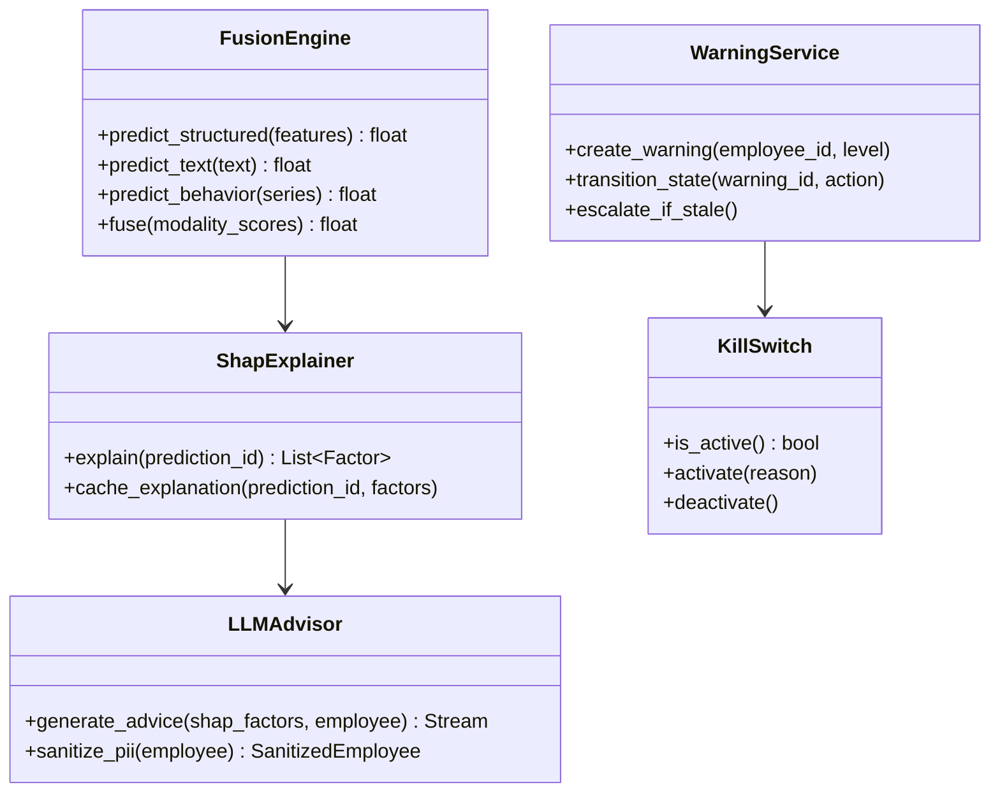

# HRA-D03 系统设计文档（SAD）

| 项 | 值 |
|---|---|
| 文档编号 | HRA-D03-V1.0 |
| 文档版本 | V1.1 |
| 编制日期 | 2026-07-27 |
| 文档状态 | 草稿 |

---

## 1. 设计概述

### 1.1 设计目标

- **可复用**：DWS 项目模块复用率 ≥ 60%
- **可解释**：每条预测附 SHAP Top3
- **可治理**：金丝雀 + 漂移 + 回滚 + Kill Switch
- **可合规**：PIPL + 欧盟 AI Act 高风险类别内建支持
- **可观测**：Metrics/Logs/Traces 三支柱全覆盖

### 1.2 设计原则

| 原则 | 含义 |
|---|---|
| 模块化 | 单一职责，模块可独立替换 |
| 异步优先 | 长耗时任务全部异步化（Celery） |
| 缓存优先 | 读多写少数据缓存（Redis） |
| 失败优雅 | 4 层回退 + 断路器 + 降级 |
| 安全内建 | PII 加密 + 多租户隔离 + 审计 |
| 可观测内建 | 三支柱代码与业务代码同步 |

### 1.3 技术栈选型表

| 维度 | 选型 | 备选 | 理由 |
|---|---|---|---|
| 后端框架 | FastAPI 0.115 | Django | async + Pydantic + 复用 DWS |
| ORM | SQLAlchemy 2.0 async | Tortoise | 复用 DWS |
| 数据库 | PostgreSQL 15 | MySQL | JSONB + 复用 DWS Alembic |
| 缓存 | Redis 7 | Memcached | pubsub + 复用 DWS |
| 异步任务 | Celery 5.4 | RQ | 复用 DWS |
| 前端框架 | Vue 3.5 + TS | React | 复用 DWS 组件 |
| UI 库 | Element Plus | Ant Design Vue | 复用 DWS |
| ML 框架 | scikit-learn + PyTorch | TensorFlow | 复用 DWS ML 模块 |
| LLM | OpenAI GPT-4 | 本地 Llama | API 简单 + 中文好 |
| 可观测 | Prometheus + Grafana | Datadog | 开源 + 复用 DWS |
| 容器 | Docker + Compose | K8s | MVP 单机部署 |
| CI/CD | GitHub Actions | GitLab CI | 复用 DWS 工作流 |

---

## 2. C4 架构模型

### 2.1 Context（系统上下文）

```
                ┌──────────────┐
                │  HRBP/HR经理  │
                └──────┬───────┘
                       │ HTTPS
                       ▼
┌──────────┐   ┌──────────────┐   ┌─────────────┐
│ 客户HR系统│──▶│   HRA 系统    │◀─│ OpenAI LLM  │
└──────────┘   └──────┬───────┘   └─────────────┘
                      │
       ┌──────────────┼──────────────┐
       ▼              ▼              ▼
  ┌─────────┐   ┌─────────┐   ┌──────────┐
  │ 邮件/短信│   │ Webhook │   │ 直线经理  │
  └─────────┘   └─────────┘   └──────────┘
```

### 2.2 Container（容器视图）

| 容器 | 技术 | 职责 |
|---|---|---|
| Web Frontend | Vue 3 + Vite + PWA | 三端 UI + WebSocket 客户端 |
| API Gateway | FastAPI + Uvicorn | REST API + WebSocket + 限流 |
| Worker | Celery Worker | 异步任务（训练/批量预测/报表） |
| Scheduler | Celery Beat | 定时任务调度 |
| Database | PostgreSQL 15 | 业务数据 + 审计日志 |
| Cache | Redis 7 | 缓存 + pubsub + 限流计数 |
| Object Storage | 阿里云 OSS | 备份 + 大文件 |
| LLM Proxy | OpenAI API | 保留建议生成 |
| Monitoring | Prometheus + Grafana | 指标采集与可视化 |
| Logs | Loki + Promtail | 日志聚合 |

### 2.3 Component（组件视图）

API Gateway 内部组件：

```
┌────────────────────────────────────────────────────┐
│                  API Gateway (FastAPI)              │
│ ┌────────┐ ┌────────┐ ┌────────┐ ┌────────┐      │
│ │ Auth   │ │ Tenant │ │ Rate   │ │ Audit  │      │
│ │ Middle │ │ Context│ │ Limit  │ │ Log    │      │
│ └────────┘ └────────┘ └────────┘ └────────┘      │
│ ┌────────────────────────────────────────────┐    │
│ │           API Routers (v1)                  │    │
│ │ auth│employee│risk│warning│advise│model│... │    │
│ └────────────────────────────────────────────┘    │
│ ┌────────────────────────────────────────────┐    │
│ │           Services Layer                    │    │
│ │ RiskService│WarningService│AdviseService│..│    │
│ └────────────────────────────────────────────┘    │
│ ┌────────────────────────────────────────────┐    │
│ │           ML Engine                         │    │
│ │ FusionEngine│ShapExplainer│LLMAdvisor│....│    │
│ └────────────────────────────────────────────┘    │
└────────────────────────────────────────────────────┘
```

### 2.4 Code（关键模块类图）



---

## 3. 架构决策记录（ADR）

### ADR-001 异步任务方案选择 Celery

- **上下文**：批量预测/模型训练/报表生成等任务耗时较长
- **决策**：采用 Celery 5.4 + Redis broker
- **备选**：RQ / Dramatiq / asyncio + APScheduler
- **理由**：复用 DWS Celery 模块；生态成熟；Celery Beat 满足定时需求
- **后果**：增加 Redis 依赖；需注意 Celery 线程安全（Dropout 问题已修复）

### ADR-002 多租户隔离方案选择行级隔离

- **上下文**：SaaS 模式下多企业客户数据隔离
- **决策**：行级隔离（每张表含 tenant_id 字段 + 中间件注入）
- **备选**：Schema 级隔离 / 库级隔离
- **理由**：MVP 阶段客户数 < 50，行级隔离成本低；复用 DWS tenant_context 模块
- **后果**：单表数据量增长后需考虑分库；查询需严格带 tenant_id（已通过中间件强制）

### ADR-003 LLM 调用方案选择国内模型（通义千问 Max）

- **上下文**：保留建议生成需 LLM 能力；PIPL 对个人信息出境有严格要求数据出境安全评估
- **决策**：主选通义千问 Max（阿里云 DashScope）+ 流式 SSE；备选 DeepSeek-V3；OpenAI 降为可选（需数据出境评估通过后方可启用）
- **备选**：OpenAI GPT-4 / 本地 Llama 3 / Claude
- **理由**：国内模型规避跨境传输评估（R20）；与阿里云 OSS/SMTP 生态一致；中文质量优；流式首字 < 2s
- **后果**：增加阿里云 DashScope 依赖；PII 脱敏仍前置；需准备 LLM 不可用时的降级方案（规则模板）；OpenAI 路径保留但默认禁用

### ADR-004 SHAP 解释服务与推理服务解耦

- **上下文**：SHAP 计算耗时 200-500ms，影响主推理路径
- **决策**：推理与 SHAP 异步分离，SHAP 结果缓存 24h
- **备选**：同步计算 / 预计算所有员工 SHAP
- **理由**：用户体验优先（先返回风险分，SHAP 异步加载）；缓存命中率 > 80%
- **后果**：首次查询无 SHAP（前端显示 loading）；缓存失效后需重新计算

### ADR-005 人在回路工作流方案选择状态机

- **上下文**：HR 申诉/标记/复核需多角色协作
- **决策**：复用 DWS 5 态状态机（New → Confirmed → Fixing → Pending Review → Closed）
- **备选**：BPMN 引擎 / 简单标志位
- **理由**：复用 DWS 状态机代码；可视化清晰；支持升级机制
- **后果**：状态转换需严格校验；新增"申诉中"子状态

### ADR-006 模型治理方案复用 DWS 金丝雀引擎

- **上下文**：新模型上线需灰度发布
- **决策**：复用 DWS canary_controller + drift_detector + auto_rollback
- **备选**：自建 / K8s Service Mesh
- **理由**：DWS 模块经过审计验证；满足 5%→25%→100% 三阶段发布
- **后果**：金丝雀观察期 72h（单租户环境）

### ADR-007 PII 加密方案选择 Fernet 字段级加密

- **上下文**：员工薪资/身份证号等敏感字段需加密
- **决策**：复用 DWS pii_crypto.py（Fernet 对称加密）
- **备选**：数据库 TDE / 应用层 AES-GCM
- **理由**：复用 DWS 代码；字段级加密灵活；密钥轮换机制已实现
- **后果**：加密字段不可直接查询（需哈希索引辅助检索）

### ADR-008 可观测性方案选择 Prometheus + Grafana + Loki

- **上下文**：需 Metrics/Logs/Traces 三支柱
- **决策**：复用 DWS Prometheus + Grafana 11.5 + 新增 Loki 日志聚合
- **备选**：ELK / Datadog / OpenTelemetry + Jaeger
- **理由**：复用 DWS 监控代码；Grafana 11.5 在 Windows Docker 验证可用；Loki 与 Grafana 集成成本低
- **后果**：日志查询能力弱于 ES；Trace 暂用 OpenTelemetry + Tempo（可选）

---

## 4. 核心模块设计

### 4.1 多模态融合引擎（复用 DWS fusion_engine）

```
输入:
  - structured_features: dict (薪资分位/晋升间隔/绩效趋势/考勤异常)
  - text_content: str (OKR自评/360反馈)
  - behavior_series: List[float] (邮件频率/会议拒绝率/登录次数)

处理:
  1. structured → LightGBM → score_struct (0-1)
  2. text → BERT（MacBERT-base-chinese，ONNX INT8 量化导出，CPU 推理 < 80ms/条）→ score_text (0-1)
  3. behavior → IsolationForest → score_behavior (0-1)
  4. fusion_priority_engine 加权融合:
     weights = {struct: 0.5, text: 0.3, behavior: 0.2}
     score_final = sum(w * s for w, s in weights.items())

输出:
  - risk_score: int (0-100)
  - risk_level: str (low/medium_low/medium/medium_high/high)
  - modality_scores: dict (供 SHAP 使用)
```

### 4.2 实时预警引擎（复用 DWS warning_service + WebSocket）

```
触发条件:
  - risk_score >= 80 → 高级预警 (P0)
  - risk_score >= 60 → 中级预警 (P1)
  - risk_score 较前日上升 >= 20 → 趋势预警 (P2)

状态机:
  New → Confirmed (HRBP 确认)
       → Fixing (HRBP 执行干预)
       → Pending Review (HR 经理复核)
       → Closed (闭环)

升级:
  - 48h 未确认 → 升级至 HR 经理
  - 72h 未进入 Fixing → 升级至管理员

去重:
  - 同员工 7 天内仅生成 1 条预警
  - 抑制期: 22:00-08:00 仅入库不推送

推送:
  - WebSocket 实时推送 HRBP
  - 邮件兜底（WebSocket 离线时）
  - 短信紧急（P0 + 24h 未确认）
```

### 4.3 SHAP 可解释性模块（新增）

```
输入:
  - prediction_id
  - model_version
  - features

处理:
  1. ShapExplainer.explain():
     - 加载对应版本的 explainer (TreeExplainer for LightGBM)
     - 计算 shap_values
     - 取绝对值 Top3 特征
  2. 缓存:
     - key: shap:{prediction_id}
     - TTL: 24h
     - 命中率监控

输出:
  [
    {"feature": "salary_percentile", "contribution": -0.15, "direction": "negative"},
    {"feature": "promotion_gap_months", "contribution": 0.12, "direction": "positive"},
    {"feature": "manager_rating_score", "contribution": -0.08, "direction": "negative"}
  ]
```

### 4.4 LLM 保留建议模块（新增）

```
输入:
  - shap_factors (Top3)
  - employee_metadata (脱敏后)

处理:
  1. PII 脱敏:
     - 员工姓名 → "员工A"
     - 身份证号 → 移除
     - 手机号 → 移除
     - 部门 → 保留
     - 岗位 → 保留
  2. Prompt 构造:
     system: "你是 HR 保留专家，基于 SHAP 归因因子生成个性化保留建议"
     user: "员工A 是技术部高级工程师，离职风险分 82/100。
            Top3 归因: 薪资分位低(43%) / 晋升停滞(28个月) / 直属经理评分低(2.8/5)。
            请生成 3 条具体保留建议，覆盖调薪/转岗/培训/辅导。"
  3. 调用通义千问 Max (stream=True，规避跨境传输)
  4. SSE 流式响应前端

输出:
  - stream: text chunks
  - metadata: {tokens_used, latency_ms, model_version}

降级:
  - LLM 不可用 → 返回模板化建议（基于规则）
```

### 4.5 模型治理模块（复用 DWS）

复用 DWS 的：
- `app/ml/canary_controller.py` - 金丝雀发布
- `app/services/drift_detector.py` - PSI/KL 漂移检测
- `app/core/kill_switch.py` - 一键关停
- `app/core/fallback_hierarchy.py` - 4 层回退
- `app/ml/model_registry_v2.py` - 模型注册表

新增 HRA 专属：
- `app/ml/fairness_monitor.py` - 公平性监测（4 项指标）
- `app/ml/ethics_audit.py` - 伦理审查日志

### 4.6 多租户隔离模块（复用 DWS tenant_context）

```
请求处理流程:
  1. 中间件从 JWT 提取 tenant_id
  2. 注入 TenantContext (contextvar)
  3. 所有 SQL 自动添加 WHERE tenant_id = :tenant_id
  4. 异常: 跨租户访问 → 403 Forbidden
  5. 审计日志记录 tenant_id + user_id + operation
```

---

## 5. 数据流设计

### 5.1 实时流

```
HRBP 查询 → API Gateway → RiskService.predict()
  → 检查缓存 (Redis: risk:{tenant}:{employee_id})
    → 命中: 返回缓存结果
    → 未命中:
      → FusionEngine.predict() (5 模态)
      → 返回 risk_score + risk_level
      → 异步: ShapExplainer.explain() → 缓存
  → 响应 HRBP
```

### 5.2 离线流

```
每日 02:00 (Celery Beat):
  → 批量预测全量员工
  → 写入 risk_cache + prediction_history
  → 触发预警生成（满足阈值）
  → 计算每日 PSI/KL 漂移
  → 生成公平性日报

每周一 06:00:
  → 评估再训练触发条件
  → 若累积 100 条标记 → 触发训练流水线
  → 训练完成 → 进入模型注册表 → 金丝雀发布
```

---

## 6. 安全设计

### 6.1 认证授权

- JWT + Refresh Token（access 30min / refresh 7d）
- RBAC 5 类角色 + 功能权限矩阵
- 2FA TOTP（管理员强制）

### 6.2 数据加密

| 数据类型 | 传输 | 存储 |
|---|---|---|
| JWT | TLS 1.3 | - |
| PII 字段 | TLS 1.3 | Fernet 字段级 |
| 密码 | TLS 1.3 | bcrypt + salt |
| 备份 | TLS 1.3 | AES-256 |
| LLM 调用 | TLS 1.3 | 脱敏后传输 |

### 6.3 审计日志

- 所有写操作：用户/时间/IP/UA/操作/前后值
- PII 访问：单独表 + 哈希链防篡改
- 日志保留：5 年
- 日志查询：仅管理员 + 审计角色

### 6.4 防重放与限流

- Idempotency-Key（写操作）
- 限流：登录 5/min、API 100/min/用户、LLM 10/min/用户
- CSP / XSS / SQL 注入防护（复用 DWS 中间件）

---

## 7. 可观测性设计

### 7.1 三支柱

| 支柱 | 工具 | 采样率 |
|---|---|---|
| Metrics | Prometheus + Grafana | 100% |
| Logs | Loki + Promtail | 100% |
| Traces | OpenTelemetry + Tempo（可选）| 10% |

### 7.2 SLI/SLO

| SLI | SLO | 告警阈值 |
|---|---|---|
| API 成功率 | ≥ 99.5% | < 99% 触发 P1 |
| API P99 延迟 | < 1s | > 2s 触发 P1 |
| 模型推理成功率 | ≥ 99% | < 98% 触发 P0 |
| LLM 调用成功率 | ≥ 95% | < 90% 触发 P2 |
| 公平性偏差 | < 5% | > 8% 触发 P0 + Kill Switch |

### 7.3 黄金信号

- **延迟**：API P50/P95/P99 + LLM 首字延迟
- **流量**：QPS + 并发数 + LLM 调用数
- **错误**：4xx/5xx 比例 + 模型推理失败率
- **饱和度**：CPU/内存/Redis 连接数/DB 连接池

---

## 8. 容灾与高可用设计

### 8.1 部署拓扑

MVP 阶段单可用区部署（数据组件采用阿里云托管服务，降低单人运维负担）：

```
单可用区
  ├── API Gateway (2 副本 + Nginx LB)
  ├── Worker (2 副本)
  ├── 阿里云 RDS PostgreSQL（高可用版，主备自动切换）
  ├── 阿里云 Redis 托管（主备 + Sentinel）
  └── 监控栈（Prometheus + Grafana + Loki 自建）
```

### 8.2 RTO/RPO

| 故障类型 | RTO | RPO |
|---|---|---|
| 单实例崩溃 | < 5min | 0 |
| 数据库主库故障 | < 30min | < 5min |
| 可用区故障 | < 1h | < 1h |
| 数据误删 | < 1h | < 24h（备份） |

### 8.3 备份策略

- 数据库：每日全量 + 每小时增量（WAL）
- Redis：每日 RDB + AOF
- OSS：跨区域复制
- 备份保留：30 天滚动

### 8.4 故障演练

- 每月 1 次故障注入测试（kill pod / DB failover / Redis 主备切换）
- 每季度 1 次完整灾备演练

---

## 9. 复用 DWS 模块清单

| DWS 模块 | HRA 复用方式 | 修改点 |
|---|---|---|
| app/core/tenant_context.py | 直接复用 | - |
| app/core/pii_crypto.py | 直接复用 | - |
| app/core/kill_switch.py | 直接复用 | - |
| app/core/fallback_hierarchy.py | 直接复用 | 替换 fallback 规则 |
| app/core/states.py | 直接复用 | 新增"申诉中"子状态 |
| app/ml/fusion_engine.py | 直接复用 | 替换模型权重 |
| app/ml/canary_controller.py | 直接复用 | - |
| app/ml/drift_detector.py | 直接复用 | - |
| app/ml/model_registry_v2.py | 直接复用 | - |
| app/services/warning_service.py | 直接复用 | - |
| app/services/gdpr_service.py | 直接复用 | - |
| app/api/v1/auth.py | 直接复用 | - |
| app/monitoring/* | 直接复用 | 新增公平性指标 |
| frontend/src/api/* | 复用模板 | 替换为 HRA 接口 |
| frontend/src/composables/useWebSocket.ts | 直接复用 | - |
| frontend/src/styles/* | 直接复用 | 调整角色色 |

**复用率估算**：65%（67 个模块中复用 43 个；其中直接代码复用 38 个、模板复用 5 个需替换为 HRA 接口/规则）

---

## 10. 变更记录

| 版本 | 日期 | 变更人 | 变更内容 | 审核人 |
|---|---|---|---|---|
| V1.0 | 2026-07-27 | 邝振华 | 初稿创建 | - |
| V1.1 | 2026-07-27 | 邝振华 | 设计审查修订：ADR-003 LLM 国内化（通义千问 Max）；4.1 BERT ONNX INT8 量化；8.1 部署拓扑改托管 RDS/Redis；9 复用率澄清 | - |
