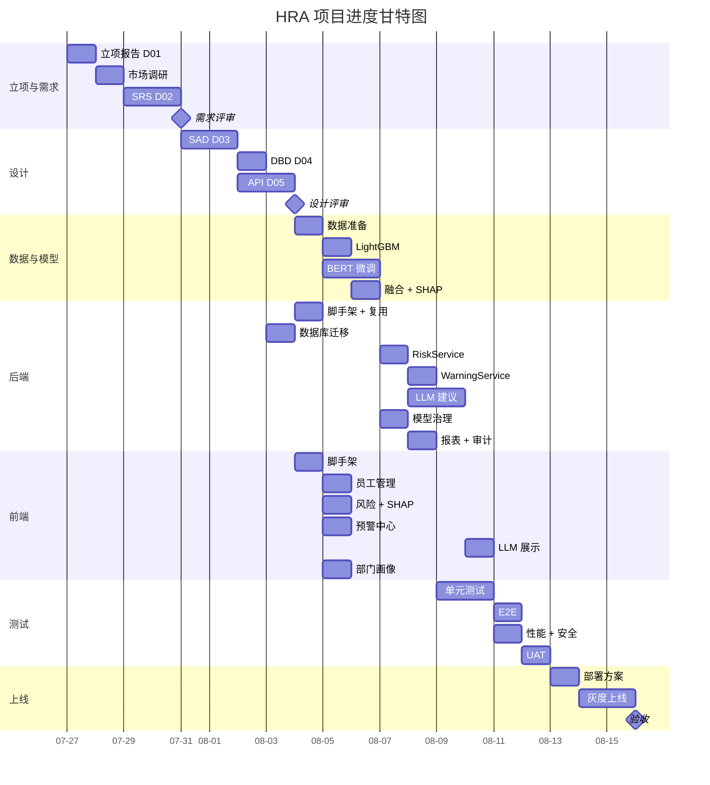

# HRA-D08 项目进度计划

| 项 | 值 |
|---|---|
| 文档编号 | HRA-D08-V1.0 |
| 文档版本 | V1.1 |
| 编制日期 | 2026-07-27 |
| 项目周期 | 2026-07-27 ~ 2026-09-21（8 周）|

---

## 1. 项目里程碑

| 里程碑 | 日期 | 准出条件 |
|---|---|---|
| M1 立项 | 2026-07-27 | 立项报告评审通过 |
| M2 需求基线 | 2026-08-03 | SRS 评审通过 |
| M3 设计基线 | 2026-08-10 | SAD + DBD + API 文档评审通过 |
| M4 Alpha | 2026-08-24 | 核心功能可演示（认证+预测+预警） |
| M5 Beta | 2026-08-31 | 全功能 + 1 家试点客户接入 |
| M6 RC | 2026-09-07 | 全部 P0/P1 缺陷关闭 |
| M7 上线 | 2026-09-14 | 部署到生产 + 监控就绪 |
| M8 验收 | 2026-09-21 | 验收标准 100% 通过 |

---

## 2. WBS 工作分解结构

### 2.1 一级分解

| 阶段 | 工期 | 占比 |
|---|---|---|
| 1. 立项与需求 | 1 周 | 12.5% |
| 2. 设计 | 1 周 | 12.5% |
| 3. 开发 | 4 周 | 50% |
| 4. 测试 | 1.5 周 | 18.75% |
| 5. 上线与验收 | 0.5 周 | 6.25% |

### 2.2 二级分解（任务级，1-2 人天粒度）

#### 阶段 1：立项与需求（W1，2026-07-27 ~ 08-03）

| 任务 ID | 任务 | 工时 | 前置 | 负责 |
|---|---|---|---|---|
| T-101 | 立项报告 D01 | 1d | - | 邝振华 |
| T-102 | 市场调研 + 竞品分析 | 1d | - | 邝振华 + AI |
| T-103 | SRS 需求规格 D02 | 2d | T-101 | 邝振华 + AI |
| T-104 | 需求评审 | 0.5d | T-103 | 邝振华 |
| T-105 | SRS 基线化 + RTM | 0.5d | T-104 | 邝振华 |

#### 阶段 2：设计（W2，2026-08-03 ~ 08-10）

| 任务 ID | 任务 | 工时 | 前置 | 负责 |
|---|---|---|---|---|
| T-201 | SAD 系统设计 D03 | 2d | T-105 | 邝振华 + AI |
| T-202 | DBD 数据库设计 D04 | 1d | T-201 | 邝振华 + AI |
| T-203 | API 接口设计 D05 | 1.5d | T-201 | 邝振华 + AI |
| T-204 | 设计评审 | 0.5d | T-203 | 邝振华 |
| T-205 | 基线化 + 启动开发 | - | T-204 | - |

#### 阶段 3：开发（W3-W6，2026-08-10 ~ 09-07）

##### W3：数据 + 模型（2026-08-10 ~ 08-17）

| 任务 ID | 任务 | 工时 | 前置 | 负责 |
|---|---|---|---|---|
| T-301 | 数据集准备（IBM + 结构化合成 SDV/CTGAN）| 0.5d | T-205 | 邝振华 + AI |
| T-301a | 合成文本数据生成（通义千问按 SHAP 模板 + 人工抽检 2k 条）| 1d | T-205 | 邝振华 + AI |
| T-301b | 合成行为时序生成（基于结构化特征时序模拟）| 0.5d | T-205 | 邝振华 + AI |
| T-302 | 数据清洗 + 特征工程 | 1d | T-301, T-301a, T-301b | 邝振华 + AI |
| T-303 | LightGBM 结构化模型训练 | 1d | T-302 | 邝振华 + AI |
| T-304 | BERT 文本模型微调 | 1.5d | T-302 | 邝振华 + AI |
| T-305 | Isolation Forest 行为模型 | 0.5d | T-302 | 邝振华 + AI |
| T-306 | 三模态融合 + Stacking | 1d | T-303,304,305 | 邝振华 + AI |
| T-307 | SHAP 解释器实现 | 0.5d | T-306 | 邝振华 + AI |
| T-308 | 公平性测试 + 模型调优 | 1d | T-307 | 邝振华 + AI |

##### W4：后端复用 + 核心服务（2026-08-17 ~ 08-24）

| 任务 ID | 任务 | 工时 | 前置 | 负责 |
|---|---|---|---|---|
| T-401 | 项目脚手架 + 复用 DWS 模块 | 1d | T-205 | 邝振华 + AI |
| T-402 | 数据库迁移脚本 | 1d | T-202 | 邝振华 + AI |
| T-403 | 认证授权模块（复用）| 0.5d | T-401 | 邝振华 + AI |
| T-404 | 多租户隔离（复用）| 0.5d | T-401 | 邝振华 + AI |
| T-405 | 员工数据管理 + PII 加密 | 1d | T-402,404 | 邝振华 + AI |
| T-406 | RiskService + 预测缓存 | 1d | T-308,405 | 邝振华 + AI |
| T-407 | WarningService + 状态机（复用）| 1d | T-406 | 邝振华 + AI |
| T-408 | WebSocket 推送（复用）| 0.5d | T-407 | 邝振华 + AI |
| T-409 | 申诉 + 标记 + 人在回路 | 1d | T-407 | 邝振华 + AI |

##### W5：LLM + 治理 + 报表（2026-08-24 ~ 08-31）

| 任务 ID | 任务 | 工时 | 前置 | 负责 |
|---|---|---|---|---|
| T-501 | LLM 保留建议服务（SSE）| 1.5d | T-406 | 邝振华 + AI |
| T-502 | PII 脱敏 + Prompt 工程 | 1d | T-501 | 邝振华 + AI |
| T-503 | LLM 降级方案（规则模板）| 0.5d | T-501 | 邝振华 + AI |
| T-504 | 模型治理（金丝雀+漂移+回滚，复用）| 1d | T-308 | 邝振华 + AI |
| T-505 | Kill Switch + 4 层回退（复用）| 0.5d | T-504 | 邝振华 + AI |
| T-506 | 公平性监测 + 伦理审计 | 1d | T-504 | 邝振华 + AI |
| T-507 | 报表服务 + PDF/Excel 导出 | 1d | T-405 | 邝振华 + AI |
| T-508 | 审计日志 + GDPR/DSR | 1d | T-405 | 邝振华 + AI |

##### W6：前端 + 集成（2026-08-31 ~ 09-07）

| 任务 ID | 任务 | 工时 | 前置 | 负责 |
|---|---|---|---|---|
| T-601 | 前端脚手架 + 复用 DWS 组件 | 0.5d | T-205 | 邝振华 + AI |
| T-602 | 登录 + 认证页面 | 0.5d | T-601 | 邝振华 + AI |
| T-603 | 员工管理页面 | 1d | T-602 | 邝振华 + AI |
| T-604 | 风险预测 + SHAP 力图 | 1d | T-602 | 邝振华 + AI |
| T-605 | 预警中心 + WebSocket | 1d | T-602 | 邝振华 + AI |
| T-606 | LLM 建议 SSE 展示 | 1d | T-501 | 邝振华 + AI |
| T-607 | 部门画像 + ECharts | 1d | T-602 | 邝振华 + AI |
| T-608 | 模型治理 + 审计页面 | 1d | T-602 | 邝振华 + AI |
| T-609 | HR 系统 CSV/SFTP 同步适配器 + 字段映射 | 1d | T-405 | 邝振华 + AI |
| T-610 | 试点客户数据接入联调 | 0.5d | T-609 | 邝振华 + 试点 |

#### 阶段 4：测试（W7，2026-09-07 ~ 09-14）

| 任务 ID | 任务 | 工时 | 前置 | 负责 |
|---|---|---|---|---|
| T-701 | 单元测试补全（80%+）| 2d | T-608 | 邝振华 + AI |
| T-702 | 集成测试 | 1d | T-701 | 邝振华 + AI |
| T-703 | 契约测试（OpenAPI）| 0.5d | T-701 | AI |
| T-704 | E2E（Playwright）| 1d | T-701 | 邝振华 + AI |
| T-705 | 性能测试（Locust）| 0.5d | T-702 | 邝振华 + AI |
| T-706 | 安全测试（ZAP + Trivy）| 0.5d | T-702 | 邝振华 + AI |
| T-707 | 公平性测试 | 0.5d | T-702 | 邝振华 |
| T-708 | UAT（试点客户）| 1d | T-704 | 试点 + 邝振华 |
| T-709 | A01 Runbook 编写（6 份：巡检/DB/Redis/LLM/公平性/泄露）| 1d | T-702 | 邝振华 + AI |

#### 阶段 5：上线与验收（W8，2026-09-14 ~ 09-21）

| 任务 ID | 任务 | 工时 | 前置 | 负责 |
|---|---|---|---|---|
| T-801 | 部署方案 D10 | 1d | T-707 | 邝振华 + AI |
| T-802 | 生产环境搭建 | 1d | T-801 | 邝振华 |
| T-803 | 灰度上线（5%→25%→100%）| 2d | T-802 | 邝振华 |
| T-804 | 监控告警接入 | 1d | T-802 | 邝振华 + AI |
| T-805 | 验收标准 D11 | 0.5d | T-801 | 邝振华 |
| T-806 | 验收会议 + 签署 | 0.5d | T-805 | 邝振华 |
| T-807 | 文档归档 + 复盘 | 0.5d | T-806 | 邝振华 |
| T-810 | A02 应急预案（ER）| 0.5d | T-802 | 邝振华 + AI |
| T-811 | A03 模型治理手册 | 0.5d | T-504 | 邝振华 + AI |
| T-812 | A04 变更管理记录 | 0.5d | T-801 | 邝振华 |

---

## 3. 关键路径

```
T-101 → T-103 → T-201 → T-203 → T-301 → T-306 → T-406 → T-501 → T-604
                                                              ↓
                                                  T-701 → T-704 → T-803 → T-806
```

关键路径总工期：约 38 工作日（8 周）

**关键路径风险**：
- T-304 BERT 微调可能超期 → 缓冲 0.5d
- T-501 LLM 调试可能反复 → 缓冲 0.5d
- T-708 UAT 受客户影响 → 启动客户招募前置

---

## 4. 甘特图（Mermaid）



---

## 5. 资源计划

### 5.1 人力投入曲线（RACI）

| 任务类别 | 负责 (R) | 问责 (A) | 咨询 (C) | 知会 (I) |
|---|---|---|---|---|
| 立项与需求 | 邝振华 | 邝振华 | 法律顾问 | - |
| 架构设计 | 邝振华 | 邝振华 | AI 工具 | - |
| ML 模型 | 邝振华 + AI | 邝振华 | - | - |
| 后端开发 | 邝振华 + AI | 邝振华 | - | - |
| 前端开发 | 邝振华 + AI | 邝振华 | - | - |
| 测试 | 邝振华 + AI | 邝振华 | - | 试点客户 |
| 上线 | 邝振华 | 邝振华 | - | 试点客户 |
| 验收 | 邝振华 | 邝振华 | 试点客户 | - |

### 5.2 环境与工具

| 环境 | 准备时间 | 责任人 |
|---|---|---|
| 本地开发 | W1 末 | 邝振华 |
| CI/CD | W2 末 | 邝振华 + AI |
| Staging | W5 末 | 邝振华 |
| Pre-prod | W7 末 | 邝振华 |
| Prod | W8 中 | 邝振华 |

### 5.3 第三方依赖

| 依赖 | 提供方 | 接入时间 | 风险 |
|---|---|---|---|
| OpenAI API | OpenAI | W5 | 中（限流/费用）|
| 阿里云 OSS | 阿里云 | W4 | 低 |
| 邮件服务 | 阿里云邮件推送 | W4 | 低 |
| 短信服务 | 阿里云短信 | W5 | 低 |
| 试点客户数据 | 试点客户 | W6 | 高（需提前 4 周启动）|

---

## 6. 里程碑评审清单

### M1 立项评审

- [ ] 立项报告评审通过
- [ ] 预算审批
- [ ] 法律顾问接入

### M2 需求评审

- [ ] SRS 评审通过
- [ ] RTM 100% 覆盖
- [ ] 法律合规初审

### M3 设计评审

- [ ] SAD + DBD + API 评审通过
- [ ] ADR ≥ 8 个
- [ ] 复用 DWS 模块清单确认

### M4 Alpha 评审

- [ ] 认证 + 员工 + 预测 + 预警主流程可演示
- [ ] 单元测试覆盖率 ≥ 60%
- [ ] 无 P0 缺陷

### M5 Beta 评审

- [ ] 全功能可演示
- [ ] 1 家试点客户接入
- [ ] PIPL 自评完成
- [ ] 伦理委员会设立

### M6 RC 评审

- [ ] 全部 P0/P1 缺陷关闭
- [ ] 单元覆盖率 ≥ 80%
- [ ] 性能 NFR 全部达标
- [ ] 公平性偏差 < 5%

### M7 上线评审

- [ ] 生产环境就绪
- [ ] 监控告警接入
- [ ] 灰度发布 5% → 25% → 100%
- [ ] 应急预案演练通过

### M8 验收评审

- [ ] 验收标准 100% 通过
- [ ] 文档 D01-D11 全部归档
- [ ] 试点客户签署验收报告
- [ ] 项目复盘完成

---

## 7. 进度跟踪机制

### 7.1 例会

| 会议 | 频率 | 时长 | 内容 |
|---|---|---|---|
| 日站会 | 每日 09:30 | 15min | 昨日完成/今日计划/阻塞 |
| 周例会 | 每周一 14:00 | 1h | 周进度/风险/计划 |
| 里程碑评审 | 每个里程碑 | 2h | 准出条件检查 |

### 7.2 报表

| 报表 | 频率 | 内容 |
|---|---|---|
| 燃尽图 | 每日 | 剩余工时趋势 |
| 看板 | 实时 | 任务状态（待办/进行/完成）|
| 风险看板 | 每周 | Top10 风险状态 |
| 周报 | 每周五 | 进度/风险/下周计划 |

### 7.3 工具

- 项目管理：飞书项目 / Notion
- 代码托管：GitHub
- CI/CD：GitHub Actions
- 文档：本仓库 docs/

---

## 8. 缓冲管理

### 8.1 缓冲分配

| 缓冲类型 | 比例 | 用途 |
|---|---|---|
| PM 缓冲 | 30% | 应对需求变更 |
| 开发缓冲 | 20% | 应对技术风险 |
| 测试缓冲 | 20% | 应对缺陷修复 |

### 8.2 缓冲使用规则

- 单任务超期 1d 内：使用任务缓冲，不升级
- 单任务超期 2d+：使用 PM 缓冲，周会同步
- 关键路径超期：触发风险升级，调整计划

---

## 9. 变更记录

| 版本 | 日期 | 变更人 | 变更内容 | 审核人 |
|---|---|---|---|---|
| V1.0 | 2026-07-27 | 邝振华 | 初稿创建 | - |
| V1.1 | 2026-07-27 | 邝振华 | 设计审查修订：W3 新增合成数据任务 T-301a/b；W6 新增 HR 集成 T-609/610；W7-W8 新增 A01-A04 任务 T-709/810/811/812 | - |
